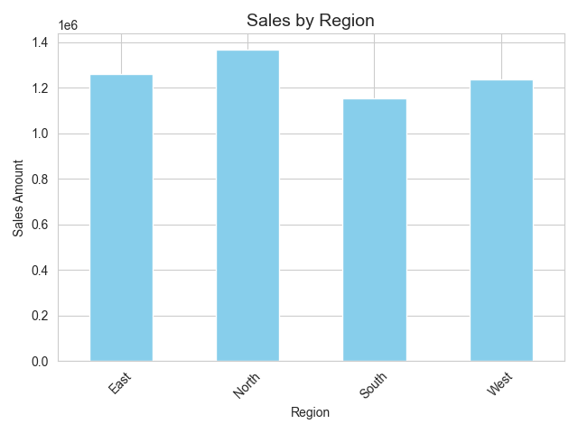
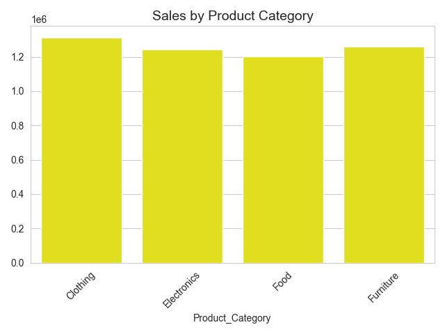
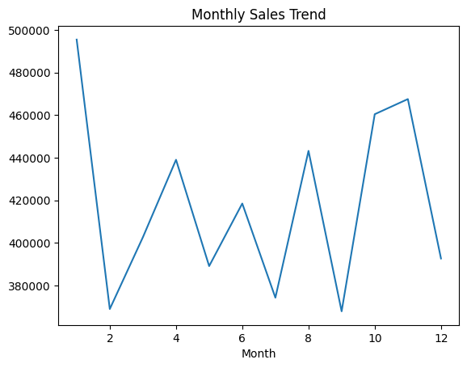
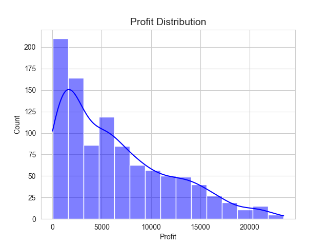

# 📊 Sales Data Analysis Project

## 📌 Overview
This project is a complete exploratory data analysis (EDA) of sales data using Python. It helps understand business performance across regions, categories, and time.

---

## 🛠 Tools Used
- Python
- Pandas
- NumPy
- Matplotlib
- Seaborn

---

## 📂 Project Steps

### 1. Data Cleaning
- Removed duplicates
- Handled missing values
- Converted date column

### 2. Feature Engineering
- Created Profit column
- Extracted Month and Year

### 3. Exploratory Data Analysis
- Sales by Region
- Sales by Product Category
- Sales by Sales Representative
- Monthly Sales Trend

---

## 📊 Visualizations

### Sales by Region


### Product Category Sales


### Monthly Trend


### Profit Distribution


---

## 🚀 How to Run

```bash
pip install pandas numpy matplotlib seaborn
python "Sales Data Analysis.py"
